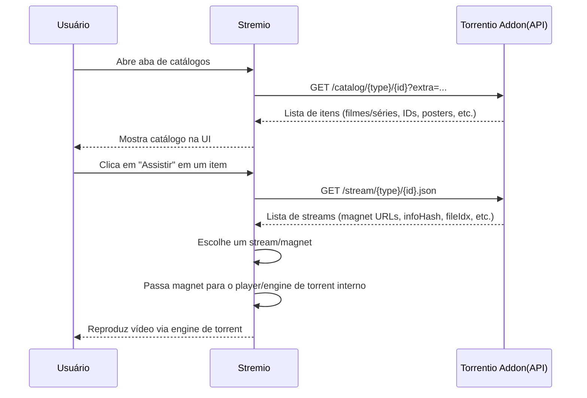
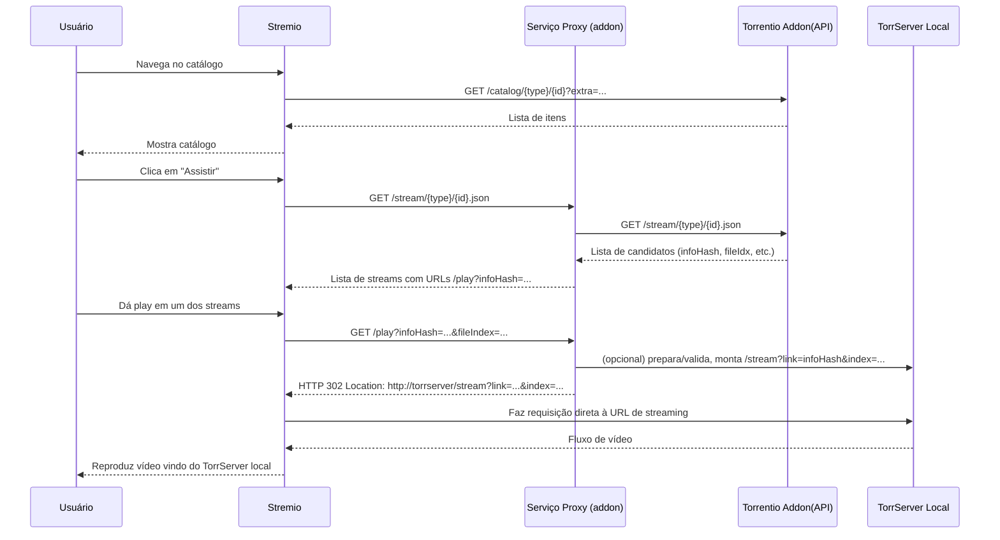

<p>
  
</p>

## Moisa – Stremio addon

### Local usage (npm)

- **Install dependencies**:

```bash
npm install
```

- **Run locally**:

```bash
npm start
```

- **Stremio manifest URL** (from the same machine):

```text
http://127.0.0.1:8080/manifest.json
```

Make sure you have a reachable TorrServer when using the addon locally.

### Docker + docker-compose

- **Start Moisa and TorrServer together**:

```bash
docker-compose up -d
```

- **Local manifest URL from the host**:

```text
http://127.0.0.1:8080/manifest.json
```

TorrServer will be available on port `8090` on the host at the same time.

### Hosted addon on Vercel

- **Public addon host**: `https://moisa-addon.vercel.app/`
- **Manifest URL for Stremio**:

```text
https://moisa-addon.vercel.app/manifest.json
```

### Configure page

The configure page is available at `https://moisa-addon.vercel.app/` (or `/configure`).

- **TorrServer URL**: enter your TorrServer base URL (for example `http://192.168.x.x:8090`).
- **Torrentio quality filter**: optionally set a custom `qualityfilter=...` string.
- Click **Generate addon URL** and use the output as the **Install addon** URL in Stremio, or click **Install in Stremio** to open it directly.

### Flows

#### Flow 1 – Direct Torrentio usage in Stremio



#### Flow 2 – Proxy-based stream redirection to local TorrServer


