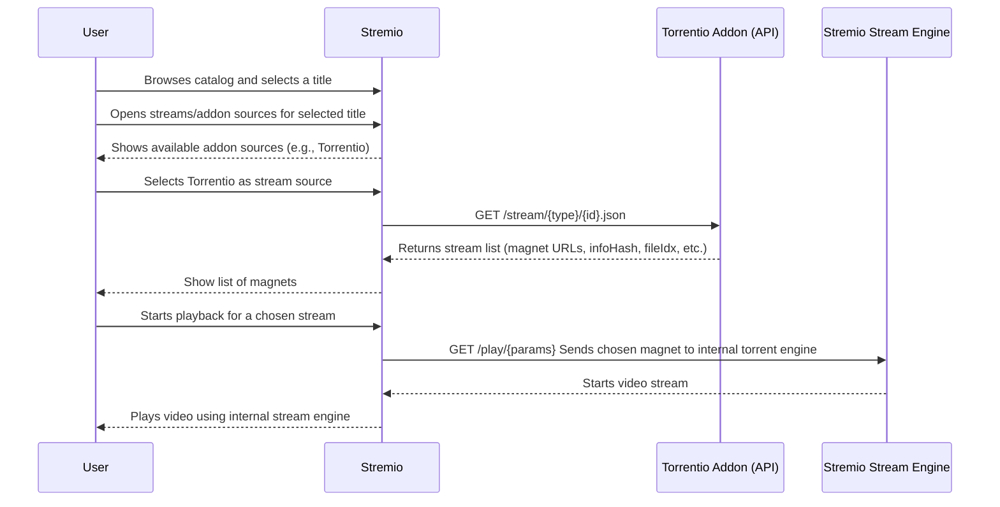
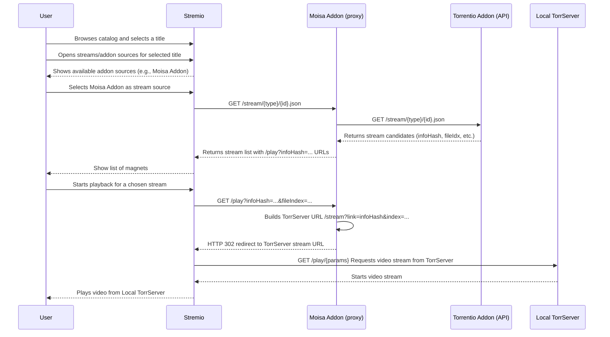

<p>
  
</p>

## Moisa – Stremio addon

Moisa is a Stremio addon that proxies torrent streams from Torrentio to a TorrServer instance you control (on your LAN or anywhere else), so playback runs through your own infrastructure instead of Stremio’s built‑in engine. The only requirement is a reachable TorrServer, which in return provides a more reliable torrent client, smoother 4K playback, and greater control over buffering, storage, and other settings.

### Local usage (npm)

- **Install dependencies**:

```bash
npm install
```

- **Run locally**:

```bash
npm start
```

- **Stremio manifest URL** (from the same machine):

```text
http://127.0.0.1:8080/manifest.json
```

Make sure you have a reachable TorrServer when using the addon locally.

### Docker + docker-compose

- **Start Moisa and TorrServer together**:

```bash
docker-compose up -d
```

- **Local manifest URL from the host**:

```text
http://127.0.0.1:8080/manifest.json
```

TorrServer will be available on port `8090` on the host at the same time.

### Hosted addon

- **Public addon host**: [https://moisa.fun](https://moisa.fun)
- **Configure URL**: [https://moisa.fun/configure](https://moisa.fun/configure)
- **Manifest URL for Stremio**: [https://moisa.fun/manifest.json](https://moisa.fun/manifest.json)

### Configure page

- **TorrServer URL**: enter your TorrServer base URL (for example `http://192.168.x.x:8090`).
- **Torrentio quality filter**: optionally set a custom Torrentio `qualityfilter=threed,480p,scr,cam,unknown` string.
- Click **Generate addon URL** and use the output as the **Install addon** URL in Stremio, or click **Install in Stremio** to open it directly.

### Flows

#### Direct Torrentio usage in Stremio flow



#### Stremio using Moisa Addon as proxy to TorrServer


