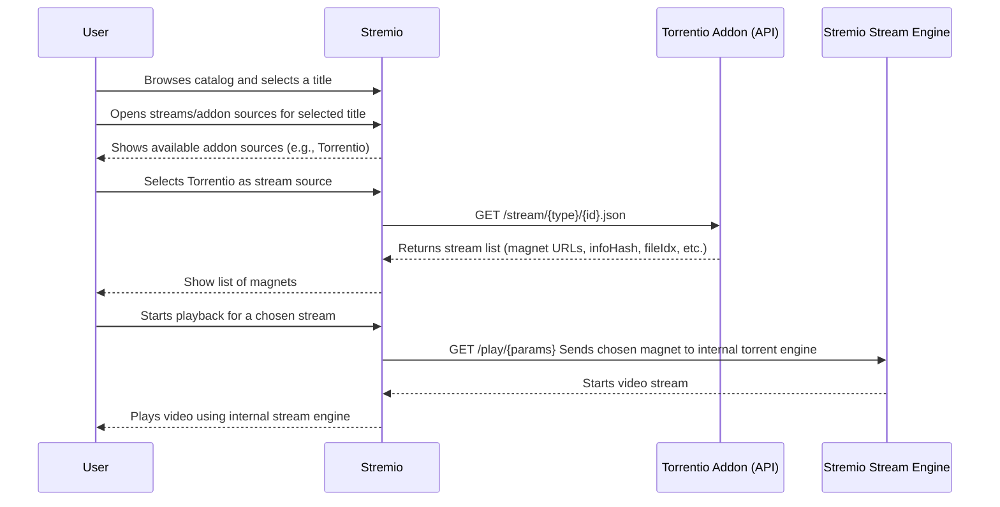
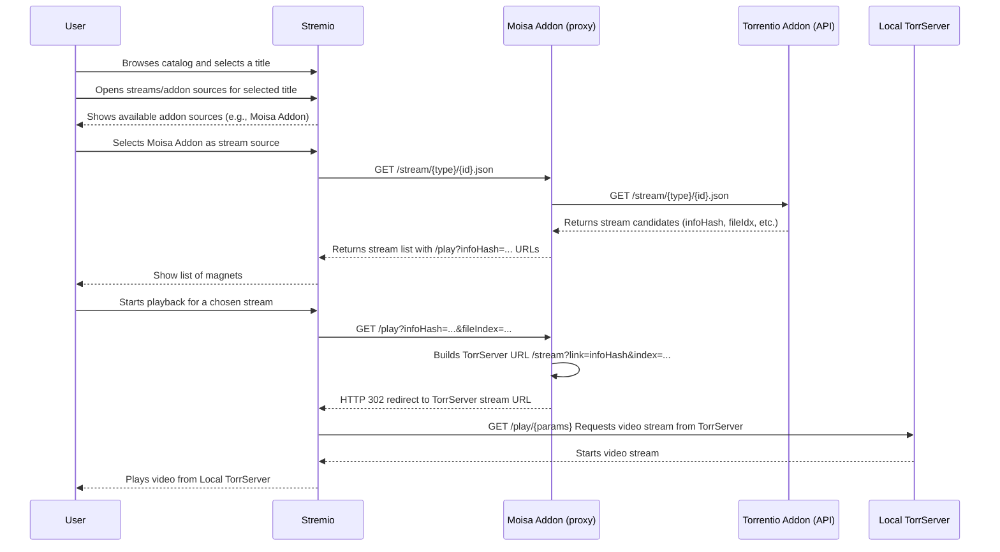

<p>
  
</p>

## Moisa – Stremio addon

Moisa is a Stremio addon that proxies torrent streams from Torrentio to a TorrServer instance you control (on your LAN or anywhere else), so playback runs through your own infrastructure instead of Stremio’s built‑in engine. The only requirement is a reachable TorrServer, which in return provides a more reliable torrent client, smoother 4K playback, and greater control over buffering, storage, and other settings.

### Local usage (npm)

- **Install dependencies**:

```bash
npm install
```

- **Run locally**:

```bash
npm start
```

- **Stremio manifest URL** (from the same machine):

```text
http://127.0.0.1:8080/manifest.json
```

Make sure you have a reachable TorrServer when using the addon locally.

### Docker + docker-compose

- **Start Moisa and TorrServer together**:

```bash
docker-compose up -d
```

- **Local manifest URL from the host**:

```text
http://127.0.0.1:8080/manifest.json
```

TorrServer will be available on port `8090` on the host at the same time.

### Hosted addon

- **Public addon host**: [https://moisa.fun](https://moisa.fun)
- **Configure URL**: [https://moisa.fun/configure](https://moisa.fun/configure)
- **Manifest URL for Stremio**: [https://moisa.fun/manifest.json](https://moisa.fun/manifest.json)

### Configure page

- **TorrServer URL**: enter your TorrServer base URL (for example `http://192.168.x.x:8090`).
- **Torrentio quality filter**: optionally set a custom Torrentio `qualityfilter=threed,480p,scr,cam,unknown` string.
- Click **Generate addon URL** and use the output as the **Install addon** URL in Stremio, or click **Install in Stremio** to open it directly.

### Environment Variables

The following environment variables can be set to configure Moisa:

- **`TORRSERVER_URL`**: Base URL of your TorrServer instance (default: `http://127.0.0.1:8090`)
- **`TORRENTIO_BASE`**: Base URL of the Torrentio API (default: `https://torrentio.strem.fun`)
- **`TORRENTIO_PATH_PREFIX`**: Quality filter for Torrentio requests (default: `qualityfilter=threed,480p,scr,cam,unknown`)
- **`TORRENTIO_TIMEOUT_MS`**: Timeout for Torrentio requests in milliseconds (default: `25000`)
- **`ENABLE_PROXY_MODE`**: Enable streaming proxy mode for external players to preserve metadata (default: `true`)
- **`ENABLE_M3U8_PLAYLISTS`**: Enable M3U8 playlist support for advanced Infuse integration (default: `false`)
- **`SELF_BASE_URL`**: Override the auto-detected base URL for this addon (useful for reverse proxies)

Example:
```bash
TORRSERVER_URL=http://192.168.1.100:8090 \
ENABLE_PROXY_MODE=true \
npm start
```

### External Player Support

Moisa automatically detects and provides enhanced metadata support for external players including:

- **Desktop Players**: VLC, MPV, PotPlayer, MPC-HC, IINA, Kodi
- **iOS/tvOS Players**: Infuse, Apple TV native player
- **Mobile Players**: VLC for iOS/Android

**For Infuse Users:**
- Automatic metadata preservation with proper filenames
- Enhanced episode naming (S01E05 format) for library organization  
- Optimized MIME type detection for better compatibility
- Support for seeking and resume functionality

**Manual Control:**
```
# Force proxy mode for any player:
http://your-moisa-url/play?infoHash=...&proxy=1

# Force redirect mode (disable proxy):
http://your-moisa-url/play?infoHash=...&proxy=0
```

### Flows

#### Direct Torrentio usage in Stremio flow


```mermaid
sequenceDiagram
    participant U as User
    participant S as Stremio
    participant T as Torrentio Addon (API)
    participant P as Stremio Stream Engine

    %% Catalog phase
    U->>S: Browses catalog and selects a title

    %% Addon/source selection
    U->>S: Opens streams/addon sources for selected title
    S-->>U: Shows available addon sources (e.g., Torrentio)
    U->>S: Selects Torrentio as stream source

    %% Stream resolution
    S->>T: GET /stream/{type}/{id}.json
    T-->>S: Returns stream list (magnet URLs, infoHash, fileIdx, etc.)
    S-->>U: Show list of magnets

    %% Playback
    U->>S: Starts playback for a chosen stream
    S->>P: GET /play/{params} Sends chosen magnet to internal torrent engine
    P-->>S: Starts video stream
    S-->>U: Plays video using internal stream engine
```

#### Stremio using Moisa Addon as proxy to TorrServer


```mermaid
sequenceDiagram
    participant U as User
    participant S as Stremio
    participant M as Moisa Addon (proxy)
    participant T as Torrentio Addon (API)
    participant R as Local TorrServer

    %% Catalog phase
    U->>S: Browses catalog and selects a title

    %% Addon/source selection
    U->>S: Opens streams/addon sources for selected title
    S-->>U: Shows available addon sources (e.g., Moisa Addon)
    U->>S: Selects Moisa Addon as stream source

    %% Stream resolution through Moisa Addon
    S->>M: GET /stream/{type}/{id}.json
    M->>T: GET /stream/{type}/{id}.json
    T-->>M: Returns stream candidates (infoHash, fileIdx, etc.)
    M-->>S: Returns stream list with /play?infoHash=... URLs
    S-->>U: Show list of magnets

    %% Playback via Local TorrServer
    U->>S: Starts playback for a chosen stream
    S->>M: GET /play?infoHash=...&fileIndex=...
    M->>M: Builds TorrServer URL /stream?link=infoHash&index=...
    M-->>S: HTTP 302 redirect to TorrServer stream URL
    S->>R: GET /play/{params} Requests video stream from TorrServer
    R-->>S: Starts video stream
    S-->>U: Plays video from Local TorrServer
```
